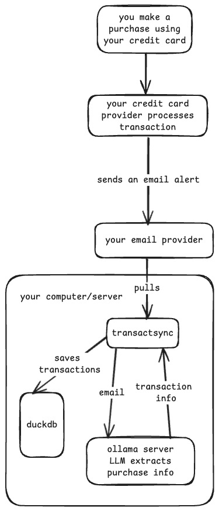

# transactsync
AI-powered Python app to log financial transactions by parsing email alerts. 
Privacy-focused, supports multiple email folders, and database checkpointing.


---

## Architecture




---

## Usage

### Requirements:

- Email providers usually requires you to use app passwords when using your email with third party apps like transactsync. You can refer to the instructions here for Gmail: https://support.google.com/mail/answer/185833?hl=en
- You have to enable email alert notifications sent to your email for credit card purchases using your online banking portal.

### CLI

```sh
uv sync

uv run src/main.py --email_host="127.0.0.1" --email_port=1143 --username="user@email.com" --password="pass1234" --folder="INBOX" --transaction_rules="./transaction_rules.yaml" --db_file="./finances.db" --prompt_file="./prompt.txt"
```

#### Optional Model Parameters


You can override the model host and model name:

```sh
uv run src/main.py ... --model_host="http://localhost:11434" --model="qwen3:8b"
```

---

### Docker

#### Build

```sh
docker build . -t transactsync
```

#### Run

You can pass sensitive or frequently changed configuration (like email credentials) as environment variables when running the container:

```sh
docker run --rm \
  -e EMAIL_HOST="127.0.0.1" \
  -e EMAIL_PORT=1143 \
  -e EMAIL_USERNAME="user@email.com" \
  -e EMAIL_PASSWORD="pass1234" \
  -e EMAIL_FOLDER="INBOX" \
  -e MODEL_HOST="http://host.docker.internal:11434" \
  -v $(pwd)/finances.db:/workspace/db/finances.db \
  -v $(pwd)/transaction_rules.yaml:/workspace/transaction_rules.yaml \
  -v $(pwd)/prompt.txt:/workspace/prompt.txt \
  transactsync
```

You can still override any value with a CLI argument if needed:

```sh
docker run --rm \
  -e EMAIL_HOST="127.0.0.1" \
  -e EMAIL_PORT=1143 \
  -e EMAIL_USERNAME="user@email.com" \
  -e EMAIL_PASSWORD="pass1234" \
  transactsync --folder="SENT"
```

Refer [templates](./templates/) for `transaction_rules.yaml` and `prompt.txt` templates. Tweak them according to your requirements.

#### Docker Compose

Refer [docker-compose](./docker-compose.yml)


---

## Support

Works with the following credit card email alerts:

- Wells Fargo
- Discover
- Chase
- Capital One
- American Express
- Citi

---

## Development

### Containerization & GitHub Container Registry (GHCR)

This project supports building and publishing a Docker image to [GitHub Container Registry (GHCR)](https://ghcr.io).

#### Build and Publish with GitHub Actions

On every release tag to `main`, a GitHub Actions workflow will build and publish the Docker image to GHCR.

#### Example GHCR Image Usage

```sh
docker pull ghcr.io/manojmukkamala/transactsync:latest
docker run --rm -it ghcr.io/manojmukkamala/transactsync:latest [ARGS]
```

#### GitHub Actions Badge


```